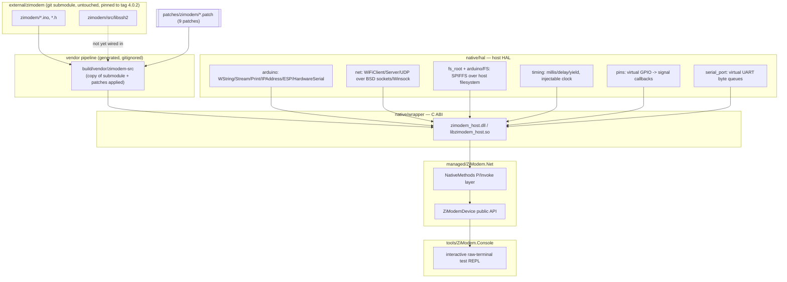

# ZiModem Host Wrapper — Design Spec

Status: core pipeline implemented and verified on Windows + Linux. Full protocol parity
(SD-shell, SSH, SLIP/PPP) is still ahead — see [§7.7](#77-not-yet-implemented) and
[§11](#11-testing-strategy) for exactly what's built vs. still open.

## 1. Purpose

`external/zimodem` is Bo Zimmerman's ESP32/ESP8266 firmware that makes a Wi-Fi-connected
ESP32 behave like a Hayes-compatible modem for retro computers (C64, Atari, CP/M
machines, etc.), including dialing over TCP, a phonebook, XMODEM/YMODEM/ZMODEM/Kermit/
Punter file transfer, an FTP client, an HTTP "browser" mode, an SSH client (vendors
libssh2), PETSCII/IRC support, SLIP/PPP, and an SD-card "shell" mode (Comet64/HostCM).

We run that same logic as a native library on Windows and Linux, driven by a C#
application, without a physical ESP32. This document specifies:

- A **copy-and-patch vendoring pipeline** that lets us compile the upstream `.ino`/`.h`
  sources unmodified-at-the-source-of-truth, re-vendoring cleanly whenever the submodule
  updates.
- A **Hardware Abstraction Layer (HAL)** that replaces the Arduino/ESP-IDF APIs the
  firmware calls (`String`, `Stream`, `WiFiClient`, `SPIFFS`, `digitalWrite`, `millis`,
  etc.) with host implementations backed by real sockets, the filesystem, and system
  clocks.
- A **C ABI wrapper** around all of that, and a **C# binding layer** on top of the ABI.
- A **test strategy** across all layers.

## 2. Non-Goals

- We are not modifying `external/zimodem` in place. It stays a pristine, unmodified git
  submodule checkout.
- We are not building an ESP32 firmware image. The build target here is a Windows/Linux
  shared library (`zimodem_host.dll` / `libzimodem_host.so`).
- We are not implementing a real UART/COM-port backend in this phase (virtual/in-process
  only — confirmed decision, not just a placeholder). The C ABI is shaped so one can be
  added later without breaking callers.
- We are not re-implementing zimodem's protocol logic. Every AT command, state machine,
  and protocol handler must behave identically to upstream; all porting effort goes into
  the layer *underneath* that code — including upstream's own bugs. (One was found during
  testing: `zircmode.ino`'s IRC mode forces serial echo on and never restores it on exit,
  confirmed present in real ESP32/ESP8266 firmware too. Left unpatched, deliberately, per
  this non-goal.)

## 3. Source Analysis Summary

`external/zimodem/zimodem/*.ino` + `*.h` is an Arduino sketch: `zimodem.ino` `#include`s
every other module's `.h` file into one translation unit (classic Arduino unity-build
style — there is no separate compilation). That matters for us: we vendor the whole
sketch as a single `.cpp` (`native/wrapper/src/zimodem_core.cpp`) that `#include`s
`zimodem.ino` first (after our `Arduino.h`), then every other `.ino` file in the sketch.

That last part is a real gotcha discovered while implementing this, not a design
choice: the Arduino builder auto-concatenates **every** `.ino` file in the sketch
folder into the build, not just the ones `zimodem.ino` itself `#include`s the `.h` side
of — `zimodem.ino` only `#include`s each module's `.h` (for declarations); the matching
`.ino` (the function bodies) is compiled in purely because it sits in the same sketch
directory. `zimodem_core.cpp` has to `#include` all of them explicitly for the same
effect. The Arduino builder also auto-generates forward declarations for every function
in the sketch (a ctags-based prototype pass) so define-after-use just works; we don't
have that pass, so a handful of functions used before their own textual definition
(`changeBaudRate`, `flushSerial`, `initSDShell`, `lc`, the `rawLogPrint*` family) need
hand-written forward declarations in `zimodem_core.cpp` instead.

Every module in the sketch touches Arduino/ESP-IDF APIs directly — there is no existing
seam between "modem logic" and "hardware." Confirmed by grep across all `.ino`/`.h`
files: `String`, `Stream`, `WiFiClient`/`WiFiServer`/`WiFiClientSecure`, `SPIFFS`, `SD`,
`IPAddress`, `digitalWrite`/`pinMode`, `millis()`/`delay()`, `HWSerial`/`DBSerial` all
appear pervasively. There is no file in the sketch that is hardware-independent.

`zimodem/src/libssh2/*` is a vendored copy of libssh2 (portable C, backend-agnostic via
`crypto.h`), much less coupled to Arduino than the rest of the sketch — not yet wired
into the host build (SSH is still excluded, see §7.7).

Key hardware-facing surface inventory:

| Concern | Upstream API | Used in |
|---|---|---|
| Serial I/O | `HWSerial`, `DBSerial`, `ZSerial : public Stream` | `serout.h/.ino`, `zimodem.ino` |
| TCP client | `WiFiClient`, `WiFiClientSecure` | `wificlientnode.h/.ino` |
| TCP server | `WiFiServer` | `wifiservernode.h/.ino` |
| UDP (NTP) | `WiFiUDP` | `rt_clock.h/.ino` |
| SSH | libssh2 (vendored) over `WiFiClient` socket | `wifisshclient.h/.ino` (not yet compiled in) |
| Wi-Fi join/status | `WiFi.begin/status/localIP/disconnect`, plus scan (`AT+WIFI`) | `zimodem.ino`, `zcommand.ino` |
| Flash config storage | `SPIFFS` | `zimodem.ino`, `zconfigmode.ino`, `phonebook.ino` |
| SD-card shell | `SD.begin(cs)` / `SD.begin()`, `fs::File` | `zbrowser.ino` (not yet compiled in) |
| GPIO signal pins (DCD/CTS/RTS/RI/DSR/DTR/OTH) | `pinMode`, `digitalWrite`, `digitalRead` | `zimodem.ino` |
| Timing | `millis()`, `delay()`, `yield()` | everywhere |
| Strings | Arduino `String` | everywhere |
| IP addressing | `IPAddress` | `connSettings.h`, `wificlientnode.h` |
| Random | `random()`, `randomSeed()` | `zircmode.ino` (nickname generation) |
| Misc CRT gaps | `itoa()` (MSVC/avr-libc extension, absent on glibc), `dtostrf()` | `serout.ino` |

This table *is* the HAL surface, and (bar SSH/SD, §7.7) it's implemented.

## 4. Architecture Overview



Four layers, each independently testable:

1. **Vendored + patched source** — a byte-for-byte copy of the submodule with a small,
   auditable set of patches applied on top (never edited by hand outside the patch
   files).
2. **HAL** — pure host code, no zimodem code in it, implementing the Arduino/ESP-IDF
   surface from the table above against Win32/POSIX primitives.
3. **Wrapper** — a thin C ABI (`extern "C"`) that owns the zimodem instance, pumps its
   background thread, and translates between HAL callbacks and a stable ABI.
4. **C# binding** — P/Invoke declarations plus an idiomatic `ZiModemDevice` class
   (events, `IDisposable`) that hides marshalling from the app developer, plus an
   interactive console app built on top of it for manual testing.

## 5. Repository Layout

```
BitMagic.ZiModem/
  external/
    zimodem/                     # submodule, never modified, pinned to tag 4.0.2 (see §3a)
  patches/
    zimodem/
      0001-add-zimodem-host-platform-branch.patch
      0002-pet2asc-host-serial-alias.patch
      0003..0008-*-no-vla.patch  # MSVC has no variable-length-array support
      0009-zmode-pure-virtual.patch
      SERIES                     # ordered list of patches to apply, with rationale comments
  tools/
    Vendoring/                   # .NET console tool: `vendor` and `new-patch` subcommands
    ZiModem.Console/             # interactive raw-terminal test REPL (references ZiModem.Net)
  native/
    hal/                         # Hardware Abstraction Layer (host code, no zimodem code)
      include/zimodem_hal/
        arduino/                 # Arduino/ESP-IDF compat headers (String, Stream, WiFi*, FS, ESP, HardwareSerial)
        fs_root.h, log.h, net.h, pins.h, serial_port.h, timing.h  # internal HAL APIs
      src/                       # net.cpp uses #ifdef _WIN32/POSIX internally, not a directory split
      tests/                     # HAL unit tests (Catch2) -- 73 tests
    wrapper/
      include/zimodem_host.h     # the public C ABI
      src/
        zimodem_core.cpp         # #includes the vendored+patched sketch
        zimodem_host.cpp         # the C ABI implementation
      tests/
        test_smoke.cpp           # drives zimodem_core directly (4 tests)
        test_c_abi.cpp           # drives the public C ABI (3 tests)
    CMakeLists.txt
  managed/
    ZiModem.Net/                 # C# binding library (P/Invoke + ZiModemDevice)
    ZiModem.Net.Tests/           # not yet created (open item, §11.3)
  docs/
    native-wrapper-spec.md       # this file
  build/                         # out-of-tree, gitignored
    vendor/zimodem-src/          # generated by `dotnet run --project tools/Vendoring -- vendor`
    native/                      # Windows CMake build output
    native-linux/                # Linux CMake build output (kept separate -- see §10)
```

`build/` is never committed. Anyone building the project runs
`dotnet run --project tools/Vendoring -- vendor` (also invoked automatically by CMake
as a pre-build step, every build) to regenerate `build/vendor/zimodem-src` from
`external/zimodem` + `patches/`. The tool is a plain .NET console app rather than a
Python script — this project already hard-depends on the .NET SDK for the wrapper's
managed side, so the vendoring tool rides on that instead of introducing a second
scripting toolchain.

### 5a. Version pin

`external/zimodem` is pinned to tag **`4.0.2`** — the actual shipped/released version —
rather than tracking the tip of the upstream branch (which at the time of writing was
27 commits further along, an unreleased `4.0.3` in progress). This is a deliberate
choice: build against what was actually shipped to users, not in-progress upstream work.
Bumping the pin later is exactly the `git submodule update --remote` + re-vendor +
re-test workflow in §6.4; the patch set was verified to reapply cleanly against 4.0.2
after being originally written against the newer commit, with zero changes needed.

Two things worth knowing if the pin is ever moved: 4.0.2 itself has two latent bugs
that show up as (harmless, non-blocking) compiler warnings on both MSVC and GCC, fixed
in the later commit we'd originally built against — `zimodem.ino`'s platform-detection
ladder has a `#ifdef X || Y` (invalid syntax; only `X` is actually checked) affecting
only ESP32S3/C3-specific branches we never select, and `rt_clock.ino` has a
`sprintf(str,"%d",dow.c_str())` format-string bug (should be `%s`) in date formatting.
Neither is introduced by our patches or affects the host build's correctness; both are
being carried faithfully per this project's "faithful to upstream, bugs included"
philosophy (§2).

## 6. Copy-and-Patch Vendoring Pipeline

### 6.1 Why not `#include` the submodule directly

We could `#include "../../external/zimodem/zimodem/zimodem.ino"` straight from wrapper
code and only patch via preprocessor macros. We're deliberately not doing that:

- Some required changes are not expressible as macros (e.g. VLA declarations MSVC can't
  compile at all — see 0003-0008 in the patch list — need real source edits, not a
  macro).
- Keeping patches as textual diffs against a *copy* means the submodule pointer is the
  only thing that moves in git history, and the patch set is small, reviewable, and
  rebases cleanly when upstream changes.

### 6.2 Process

1. `tools/Vendoring vendor` deletes and recreates `build/vendor/zimodem-src/` as a
   recursive copy of `external/zimodem/`, normalizing line endings to LF for the C/C++
   source extensions the patches touch (`.ino`, `.h`, `.c`, `.cpp`) — see §6.3a for why.
2. It reads `patches/zimodem/SERIES` (one patch filename per line, applied in order) and
   runs `git -c core.autocrlf=false apply --directory=build/vendor/zimodem-src <patch>`
   for each.
3. If any patch fails to apply, the tool aborts loudly (upstream has drifted — patches
   need rebasing) rather than silently producing a partially-patched tree.
4. CMake's configure/build step invokes this tool automatically (an `ALL` custom
   target that always runs) before compiling `native/wrapper`.
5. `tools/Vendoring new-patch <name>.patch` is the reverse direction: diff hand-edits
   made directly under `build/vendor/zimodem-src` against a fresh copy of
   `external/zimodem`, write the result to `patches/zimodem/<name>.patch`, and append it
   to `SERIES`.

### 6.3 What belongs in a patch vs. what belongs in the HAL

Patches are for **mechanical portability changes only** — never behavior changes. The
9 patches actually in the tree, by category:

- **Platform branch selection** (0001, 0002): adds a `ZIMODEM_HOST`/`ZIMODEM_HOST_BUILD`
  branch to the same `#if`/`#elif` ladders that already distinguish ESP32 from ESP8266
  (`zimodem.ino`, `pet2asc.h`), so host builds get their own `SerialConfig`/
  `debugPrintf`/pin/`HWSerial` definitions instead of silently falling into the ESP8266
  branch. Also disables `INCLUDE_SSH`/`INCLUDE_SD_SHELL`/`INCLUDE_SLIP`/`INCLUDE_PPP`/
  `INCLUDE_PING`/`INCLUDE_OTH_UPDATES` for this build phase, via the *same* `#undef`
  mechanism upstream already uses per-platform (§7.7).
- **No-VLA** (0003-0008): MSVC has no variable-length-array support (a GCC/
  arduino-esp32-toolchain extension the vendored code relies on in ~8 places), and VLAs
  aren't standard C++ on *any* compiler, so this is a genuine cross-platform gap, not
  something a HAL header can paper over. Each site becomes a `std::vector`-backed heap
  buffer, with the raw pointer kept under the original variable name so every
  downstream use of it is untouched — a storage-location change only. 0005 additionally
  `const_cast`s one `strrchr` result in `proto_ftp.ino` where the function later writes
  through it despite a `const char*` parameter (GCC accepts the implicit conversion,
  MSVC correctly doesn't).
- **Pure-virtual fix** (0009): `ZMode` declared `serialIncoming()`/`loop()` as plain
  virtual with no definition anywhere. Every concrete mode overrides both and nothing
  calls `ZMode::` directly, so GCC's linker tolerates the missing base vtable slot but
  MSVC's doesn't (`LNK2001 unresolved external symbol`). Marking them `= 0` is the
  idiomatic, behavior-preserving fix — `ZMode` was never instantiated directly.

Everything else — sockets, filesystem, timing, GPIO, `String`/`Stream`, missing CRT
functions like `itoa` — is implemented by providing header-compatible replacement types
in the HAL and getting the include path order right. If a patch would change *logic*
(not just compilation), that is a signal the HAL is missing something, not that the
patch is correct.

### 6.3a The autocrlf gotcha

A real bug found during Linux verification, not a Windows-only quirk: `core.autocrlf`
(commonly `true` by default in Git for Windows installs, commonly unset/`false` on
Linux) controls whether git converts LF↔CRLF on checkout/commit. The submodule's
checked-out files pick up whatever the *checking-out machine's* git defaults to, but
patches are authored once against one specific line-ending convention. `git apply`'s
context matching is byte-exact, not EOL-aware — Windows' `git apply` happened to
tolerate the mismatch (or normalize it via its own autocrlf handling when writing the
result back out, re-introducing CRLF even after our own copy step normalized to LF),
while Linux's `git apply` didn't, failing outright.

Fixed at the root, not worked around per-machine: `tools/Vendoring`'s copy step
normalizes text source files to LF (byte-level, only for the specific file extensions
the patches touch — deliberately *not* applied to the binary files also present in
`external/zimodem`, like `cbm8bit/*.d64` disk images), and every `git apply`/`git diff`
invocation the tool makes forces `-c core.autocrlf=false`, so the pipeline's behavior
is deterministic regardless of what any given machine's git installation defaults to.

### 6.4 Updating when upstream changes

```
git submodule update --remote external/zimodem
dotnet run --project tools/Vendoring -- vendor   # re-copy + re-apply patches, fails loudly on conflict
# fix up patches/zimodem/*.patch as needed (tools/Vendoring new-patch helps regenerate them)
ctest --test-dir build/native                     # full native + HAL suite must still pass (both OS build dirs)
ctest --test-dir build/native-linux
```

## 7. Hardware Abstraction Layer (HAL)

The HAL lives in `native/hal` and has zero dependency on zimodem code — it is a
standalone library that happens to expose the exact type/function surface the
vendored sketch expects, one compat header per Arduino/ESP-IDF header it replaces.

### 7.1 Compat headers (`native/hal/include/zimodem_hal/arduino/`)

| Header | Provides | Host backing | Status |
|---|---|---|---|
| `Arduino.h` | `millis`/`delay`/`yield`, `pinMode`/`digitalWrite`/`digitalRead`, `byte`, `PROGMEM`, `pgm_read_byte_near`, `dtostrf`, `itoa` (POSIX only), `random`/`randomSeed`, `SERIAL_8N1` | Aggregates every header below plus `zimodem_hal::timing`/`pins` | done |
| `WString.h` | `String` | `std::string`-backed, scoped to exactly the methods the sketch calls (verified by grep, not the full Arduino API) | done |
| `Print.h`, `Stream.h` | `Print`/`Stream` base classes, incl. `print()`/`println()`/`printf()` | matches real Arduino's virtual dispatch shape closely — `zircmode.ino` calls these directly on `Stream*`/`WiFiClientNode*`, so this isn't optional fidelity | done |
| `IPAddress.h` | `IPAddress` | 4-octet struct, `toString()`, `operator[]` | done |
| `WiFi.h` | `WiFiClass` | "always connected" against a placeholder address (§7.5); `scanNetworks`/`SSID`/`RSSI`/`encryptionType`/`macAddress` report "no networks" rather than fabricating fake ones | done |
| `WiFiClient.h`, `WiFiServer.h`, `WiFiUdp.h` | `WiFiClient`, `WiFiServer`, `WiFiUDP` | real BSD sockets (Winsock2 on Windows, POSIX on Linux) via `zimodem_hal::net` | done |
| `FS.h` | `File`, `FS`, `SPIFFSClass` | `zimodem_hal::fs_root`-backed real host directory; binary-mode I/O throughout to avoid CRT text-mode CRLF translation corrupting the sketch's own framing | done |
| `ESP.h` | `ESPClass` (`getSdkVersion`/`getFlashChipId`/`getCpuFreqMHz`/etc.) | fixed, host-appropriate placeholder values — there is no real flash chip or SDK to report | done |
| `HardwareSerial.h` | `HardwareSerialCompat` (aliased to `HWSerial` via patch 0002) | `zimodem_hal::serial_port`'s virtual UART byte queues | done |
| `WiFiClientSecure` | — | not implemented; `createWiFiClient(bool SSL)` in `wificlientnode.h` only requests it under `#ifdef ZIMODEM_ESP32`, which our `ZIMODEM_HOST` branch isn't, so it already falls back to plain `WiFiClient` regardless of the SSL flag — same fallback behavior the ESP8266 build has | n/a (upstream's own fallback covers us) |
| `SD.h`, libssh2 crypto backend | — | not implemented | not started, §7.7 |

### 7.2 Execution model — native background thread + callbacks

The wrapper owns a dedicated thread (`native/wrapper/src/zimodem_host.cpp`) that runs
the translated `setup()` once, then loops calling the translated `loop()` continuously
(with a 1ms sleep between iterations — see the comment there for why that's plenty),
mirroring the ESP32 firmware's own `void loop()` in `zimodem.ino`. This means:

- `delay(ms)` in vendored code does a real sleep **of that background thread only** —
  it does not block a P/Invoke caller. Several protocol handlers (`changeBaudRate`,
  `connectWifi`) call `delay()` expecting to stall the whole device momentarily, which
  is faithful to real hardware behavior and fine on a dedicated thread. Confirmed in
  practice: `setup()` alone takes a few real seconds (baud-rate change + serial-config
  change, each with their own `delay(500)`, then a reset that prints the startup
  banner, then an NTP send) — tests and the console app both budget for this.
- All state mutation happens on this one thread. `zimodem_host_write_serial()` enqueues
  onto a mutex-guarded queue (`zimodem_hal::serial_port`) the loop thread drains each
  iteration, rather than mutating zimodem globals from an arbitrary caller thread.
- Outbound data/events (bytes to send to the "modem", DCD/RI signal changes, log lines)
  are delivered via callbacks invoked **on the background thread**. `ZiModemDevice`
  (the C# binding) does not marshal these onto any other thread or queue — event
  handlers fire synchronously on the native background thread, full stop. This is
  simpler than the queued/`SynchronizationContext`-aware design originally sketched
  here, and correct for every consumer built so far (the console app just writes
  straight to `Console`), but is worth revisiting if a future consumer needs
  push-to-UI-thread semantics.
- Exceptions from vendored/HAL code are caught inside the background-thread loop
  (`native/wrapper/src/zimodem_host.cpp`'s `run()`) and reported via the log callback
  rather than propagating out and crashing the host process.
- One instance per process, enforced (`zimodem_host_create()` returns `NULL` if one
  already exists) — `zimodem_hal`'s serial/pins/fs/log state is process-global, matching
  the vendored firmware's own assumption that it's the only thing running on the chip.

### 7.3 Virtual serial (UART) — in-process only

There is no real COM port / `/dev/tty*` backend (confirmed decision, not deferred). The
HAL's serial surface (`zimodem_hal::serial_port`) is two byte queues:

- **Host → modem**: `zimodem_host_write_serial(handle, bytes, len)` → `feed_input()`
  pushes onto a mutex-guarded queue; `HardwareSerialCompat` (aliased to `HWSerial`)
  reads from it on the loop thread exactly where it would have called
  `HWSerial.available()/read()`.
- **Modem → host**: any `ZSerial`/`HWSerial` write calls `zimodem_hal::serial_port::write()`,
  which invokes the registered `on_serial_out(bytes, len)` callback synchronously.

The ABI is shaped so a real serial-port backend could be added later as an alternative
producer/consumer of the same two queues without changing the public surface used
today — not yet attempted.

### 7.4 GPIO / modem control signals → events

DCD/CTS/RTS/RI/DSR/DTR/OTH have no physical meaning on a host PC. `digitalWrite`/
`digitalRead` (`zimodem_hal::pins`) are backed by an in-memory pin-state table, and any
write that changes a pin's value raises an `on_signal(pin, active)` callback
synchronously (redundant writes of the same value don't re-fire it). Verified in
practice: DCD (pin 10, active-low) reads `1` before dialing and `0` immediately after a
successful `ATDT` connect, observed through both `zimodem_core_tests` (direct) and
`zimodem_host_tests` (through the C ABI's signal callback).

### 7.5 Wi-Fi join semantics

A host PC is already networked, so `WiFiClass` reports `WL_CONNECTED` immediately
against a fixed placeholder address (`127.0.0.1` — real host-adapter detection isn't
implemented, see §12 open decisions) rather than modeling a join/leave lifecycle.
`AT+WIFI`-style commands that attempt to join a *new* SSID are accepted no-ops; the
network-scan listing (`scanNetworks`/`SSID`/`RSSI`/`encryptionType`) reports zero
networks found rather than fabricating fake ones. `WiFi.hostByName()` and
`TcpSocket::connect()` both do real DNS resolution (`getaddrinfo`), so `ATDT hostname:port`
genuinely resolves and dials real hosts.

### 7.6 Logging

`debugPrintf`/`DBSerial` route to a single `on_log(message)` callback. Off by default
in the console app (`--log`/`-v`/`--verbose` to enable) — firmware debug chatter is
noisy and not what you want when just exercising AT commands.

### 7.7 Not yet implemented

Deliberately excluded from the host build via the same `INCLUDE_*` flag mechanism
upstream already uses per-platform (all `#undef`'d in patch 0001):

- **`INCLUDE_SD_SHELL`** (and everything gated behind it: XMODEM/YMODEM/ZMODEM/Kermit/
  Punter, Comet64/HostCM, the file browser, CBM/pulse-dial modem emulation) — needs a
  virtual SD-card filesystem HAL, not yet built.
- **`INCLUDE_SSH`** — needs libssh2 wired up against a crypto backend (OpenSSL is the
  leading candidate, unconfirmed — see §12). `WiFiClientSecure` already degrades
  gracefully without this (§7.1), so plain TCP/HTTP/FTP work fine without it.
- **`INCLUDE_SLIP`**, **`INCLUDE_PPP`** — would need a virtual network-interface HAL
  piece with no obvious host analogue yet.
- **`INCLUDE_PING`** — genuinely can't be ported without emulating raw lwIP ICMP
  sockets (ESP-IDF-specific, no host equivalent); likely permanently out of scope
  unless reconsidered.
- **`INCLUDE_OTH_UPDATES`** (OTA firmware self-update) — no host equivalent makes
  sense; permanently out of scope.

Everything **not** behind those flags compiles and has been manually verified working:
core AT command engine, TCP dial/answer/phonebook, HTTP client, FTP client, and IRC
mode (`INCLUDE_IRCC` is *not* excluded — it has no SD/SSH/lwIP dependency in the parts
compiled in, confirmed by testing `AT+IRC` through the console app).

## 8. Native Wrapper — Public C ABI

`native/wrapper/include/zimodem_host.h`, `extern "C"`, opaque handle, stable ABI
(no C++ types crossing the boundary) so it P/Invokes cleanly. Implemented and tested
(`native/wrapper/src/zimodem_host.cpp`, `native/wrapper/tests/test_c_abi.cpp`, 3 tests):

```c
typedef struct zimodem_instance* zimodem_handle;

typedef struct zimodem_host_config { const char* data_dir; } zimodem_host_config;

typedef void (*zimodem_serial_out_cb)(void* user_context, const uint8_t* data, size_t len);
typedef void (*zimodem_signal_cb)(void* user_context, int pin, int active);
typedef void (*zimodem_log_cb)(void* user_context, const char* message);

zimodem_handle zimodem_host_create(const zimodem_host_config* cfg);
void           zimodem_host_set_callbacks(zimodem_handle h,
                                           zimodem_serial_out_cb on_serial_out,
                                           zimodem_signal_cb on_signal,
                                           zimodem_log_cb on_log,
                                           void* user_context);
int            zimodem_host_start(zimodem_handle h);
int            zimodem_host_write_serial(zimodem_handle h, const uint8_t* data, size_t len);
void           zimodem_host_destroy(zimodem_handle h);
```

Two deliberate departures from this section's original first-draft sketch, both found
while actually implementing it:

- **`create()` no longer auto-starts the background thread; `zimodem_host_start()` is a
  separate call.** The original sketch started the thread inside `create()`, which races
  against the caller's chance to call `zimodem_host_set_callbacks()` — any debugPrintf/
  signal/serial-out activity during that window (and the vendored sketch's `setup()` does
  produce some) would be silently dropped. Corrected sequence: `create()` →
  `set_callbacks()` → `start()` → ... → `destroy()`.
- **Only one `zimodem_handle` may exist per process at a time** — `create()` returns
  `NULL` if one already exists. `zimodem_hal`'s serial/pins/fs/log state is process-global
  (matching the vendored firmware's own assumption that it's the only thing running on
  the chip), so a second concurrent instance would corrupt the first one's state rather
  than behave independently. This mirrors real hardware (there is only ever one modem)
  rather than being an arbitrary limitation to lift later — see `zimodem_host.h`'s own
  header comment for the full rationale.
- **`data_dir` is required, not optional.** An earlier version let `data_dir` be `NULL`
  and silently created a fresh OS temp directory. Removed deliberately: a library
  choosing a filesystem location on the caller's behalf is a footgun (config/phonebook
  silently fail to persist across restarts unless the caller happens to know to pass a
  path), and it's exactly the kind of implicit behavior this project otherwise avoids.
  `zimodem_host_create()` now fails (`NULL`) if `cfg` is `NULL` or `data_dir` is
  `NULL`/empty. Callers that genuinely want a throwaway directory compute one themselves
  and pass it explicitly — the choice stays visible at the call site instead of being
  buried in the library.

Design rules: no `std::string`/`std::vector` in the signature, no exceptions crossing
the boundary (every C++ exception from vendored/HAL code is caught inside the
background-thread loop and reported via the log callback rather than propagating out),
and `zimodem_host_write_serial` is safe to call from any thread (it's a thread-safe
queue push, consumed by the background thread's next `loop()` iteration).

## 9. C# Binding Layer (`managed/ZiModem.Net`)

- `NativeMethods` (internal): raw P/Invoke declarations, one-to-one with the C ABI.
- Public `ZiModemDevice : IDisposable` (`managed/ZiModem.Net/ZiModemDevice.cs`), exposing:
  - `ZiModemDevice(string dataDir)` — creates the native instance; `dataDir` is
    required (§8 — no silent temp-directory fallback); throws if one already exists in
    the process (§8's singleton constraint).
  - `void Start()`
  - `void WriteSerial(ReadOnlySpan<byte> data)`
  - `event EventHandler<SerialDataEventArgs> SerialDataReceived;`
  - `event EventHandler<SignalChangedEventArgs> SignalChanged;`
  - `event EventHandler<ZiModemLogEventArgs> Log;`
- All three events fire **synchronously on the native background thread** — not the
  thread that constructed the object, not a captured `SynchronizationContext`. This is
  a deliberate simplification versus the `ConcurrentQueue`-based design originally
  sketched here: correct and simple for every consumer built so far, but a caller
  needing UI-thread affinity must marshal there itself. Documented in the class's XML
  remarks.
- **RID-aware native asset resolution**, done: `ZiModem.Net.csproj` copies each
  platform's native binary into its own `runtimes/<rid>/native/` subfolder of the build
  output (`win-x64`/`linux-x64`), and `NativeLibraryResolver.cs` registers a custom
  `DllImportResolver` that loads the one matching the running OS. This replaced an
  earlier flat-copy design ("put whichever binary exists straight in the output
  folder") that broke in practice: under WSL, Windows and Linux share one physical
  filesystem, so a Windows build and a Linux build of `zimodem_host` sitting in the
  *same* shared output folder meant whichever one was copied there most recently
  silently clobbered the other — discovered when manually copying the Linux `.so` in
  for a WSL test run deleted the Windows `.dll` a `dotnet run` moments later needed.
  Separate `runtimes/<rid>/native/` subfolders let both coexist on disk at once
  (verified: both binaries present simultaneously, each platform's build correctly
  loading its own), which is also exactly the layout `Pack="true"`/`PackagePath`
  already sets up for a real `dotnet pack` later (§12 still tracks the remaining
  packaging work — publishing an actual NuGet package — but the resolution mechanism
  itself is done).

### 9.1 Manual test console (`tools/ZiModem.Console`)

An interactive .NET console app, referencing `ZiModem.Net` directly (project reference,
not the NuGet package, so it always runs against the current build). Implemented and
manually verified end-to-end on both Windows and Linux (WSL), including a live AT
round-trip and a real TCP dial through a loopback echo server.

Actual design (revised twice from the original sketch based on real testing feedback):

- **Every keystroke forwards to the modem immediately and raw**, including backspace/
  DEL — this is deliberately a real terminal, not a line editor. The original design
  used `Console.ReadLine()`, which handles all line-editing (backspace, etc.) at the OS
  level before the app ever sees it, meaning the AT command engine's own line editor
  (`zcommand.ino`, S-register `BS`) was never actually being exercised. Verified fixed
  by typing `ATX` + backspace + `Z` + Enter and observing the firmware correctly
  execute `ATZ` (reset banner reappears) rather than an `ERROR` on `ATXZ`.
- **Zero local echo of any kind.** Everything printed is either the modem's own output
  (`SerialDataReceived`) or the app's own `[SIGNAL]`/`[LOG]` annotations — never a copy
  of what was typed. (An earlier revision added local echo plus an automatic `ATE0` to
  avoid double-echo against the terminal's own local echo; removed once per-keystroke
  raw forwarding made the terminal's automatic echo moot — `Console.ReadKey(intercept:
  true)` suppresses it, so the only echo source left is the modem's own, on by
  default.)
- Two input sources share one byte-processing path (`HandleByte`) so the same
  forwarding logic applies whether run interactively (`Console.ReadKey`) or with stdin
  piped from a test harness (`Console.ReadKey` throws on redirected input, so that case
  reads a raw byte stream instead) — this dual-path design is also what made verifying
  the backspace fix possible without a real TTY.
- Local (never forwarded) commands are reserved control keys, not text commands: real
  per-keystroke forwarding means the app can't peek at a full line before deciding
  whether it's a local command. `Ctrl+Q` quits, `Ctrl+D` prints the data directory.
- `--echo <port>` (repeatable) starts loopback TCP echo servers at startup for `ATDT`
  testing; `--datadir <path>` pins a persistent config/phonebook location instead of a
  fresh temp dir every run; `--log`/`-v`/`--verbose` enables `[LOG]` firmware debug
  output (off by default — noisy).

## 10. Build System

- Top-level CMake (`native/CMakeLists.txt`):
  - `set(CMAKE_POSITION_INDEPENDENT_CODE ON)` project-wide. Real Linux requirement, not
    a Windows-only concern: `zimodem_host` (a shared library) links `zimodem_core`/
    `zimodem_hal` (static libraries), and Linux requires `-fPIC` for anything going
    into a `.so` — CMake doesn't enable it for static libs by default. Windows DLLs have
    no such requirement, which is exactly why this only surfaced during Linux
    verification.
  - `CMAKE_RUNTIME_OUTPUT_DIRECTORY`/`CMAKE_LIBRARY_OUTPUT_DIRECTORY` both set to
    `${CMAKE_BINARY_DIR}/bin` — every executable and shared library lands in one
    directory (rather than each target's own subdirectory) so test binaries can find
    `zimodem_host`'s shared library next to them at runtime.
  - `zimodem_vendor` — `ALL` custom target invoking `dotnet run --project
    tools/Vendoring -- vendor`; every native target depends on it, and it always runs
    (not a one-time configure step), so editing a patch and rebuilding picks it up.
  - Catch2 is fetched once here via `FetchContent` (not repeated per test directory —
    `CMAKE_MODULE_PATH` changes from a sibling subdirectory don't propagate to other
    siblings, only to scopes added afterward, so fetching it in more than one place
    silently breaks `catch_discover_tests()` in whichever one fetched it second).
- `native/hal`: `zimodem_hal` static lib + `zimodem_hal_tests` (Catch2, 73 tests).
- `native/wrapper`: `zimodem_core` static lib (compiles the vendored/patched sketch) +
  `zimodem_host` shared lib (the C ABI) + `zimodem_core_tests` (4 tests, drives
  `zimodem_core` directly) + `zimodem_host_tests` (3 tests, drives the C ABI).
- **Two toolchains verified**: MSVC (Windows x64, via a VS Developer Command Prompt +
  Ninja) and GCC 11 (Linux x64, via WSL/Ubuntu + Unix Makefiles — Ninja isn't installed
  there, plain `make` works fine). No CI automation of this matrix yet (§12).
- No `native/hal/src/win` vs `native/hal/src/posix` directory split happened in
  practice — the only platform-specific code (`net.cpp`: Winsock2 vs POSIX sockets,
  `ioctlsocket`/`FIONREAD` vs `ioctl`/`FIONREAD`) turned out small enough to keep as
  `#ifdef _WIN32` blocks within shared files rather than splitting into parallel
  directory trees.
- `managed/ZiModem.Net.csproj` copies each platform's native binary from its CMake
  build output directory into `runtimes/<rid>/native/` (see §9) — checks both
  `build/native/bin` (a single-OS build directory, e.g. a dedicated CI runner) and
  `build/native-linux/bin` (this repo's local convention for a Linux build living
  alongside a Windows one on the same machine) as candidate sources for the Linux
  binary specifically, so either layout works without changes.

## 11. Testing Strategy

**80 tests total, passing on both Windows (MSVC) and Linux (GCC, via WSL) as of this
writing.**

### 11.1 HAL unit tests (`native/hal/tests`, Catch2, no zimodem code involved) — 73 tests, done

`String`/`Stream`/`Print`/`IPAddress` compat behavior (scoped to exactly what the
sketch calls, verified by grep — not a guess at the full Arduino API), real loopback
TCP/UDP socket tests (`net.h`), SPIFFS-over-real-directory tests (`fs_root.h`/`FS.h`),
injectable-clock timing tests, GPIO/signal-bus tests, and virtual-UART serial-queue
tests. One real bug this layer's own tests *didn't* catch (caught instead by §11.2, see
below): `TcpSocket::available()` originally used a 1-byte `MSG_PEEK`, so it only ever
returned 0 or 1 — the HAL tests only asserted `available() > 0`, never checked an
exact multi-byte count. Fixed with `FIONREAD`/`ioctlsocket`.

### 11.2 Protocol-level tests against the *real* vendored code (`native/wrapper/tests`)

**`test_smoke.cpp` (drives `zimodem_core` directly, 4 tests, done):**
- `setup()`/`loop()` run without crashing.
- Plain AT command: `"AT\r"` → exactly `"AT\r\nOK\r\n"` (real observed behavior, not
  guessed from reading ~4600 lines of `zcommand.ino`).
- `ATDT` dials a real loopback `TcpListener`, gets `CONNECT 1`, DCD asserts (active-low).
- Bidirectional data passthrough after `CONNECT` (this is the test that caught the
  `TcpSocket::available()` bug above).

**`test_c_abi.cpp` (drives the C ABI, 3 tests, done):** singleton enforcement, full
`create → set_callbacks → start → AT round trip → destroy` lifecycle, `ATDT` dial with
DCD verified via the signal callback.

**Not yet covered** (code compiles and works per manual console-app testing, but has no
automated assertions):
- HTTP/FTP client, IRC mode.
- `+++` escape sequence (timing-sensitive — `zimodem_hal::serial_port` has no
  inter-byte timing model yet, so this needs a dedicated test design, not just more
  assertions).
- `ATH` hangup, error responses, phonebook persistence round-trip across a data-dir
  reload.
- Everything in §7.7 (SD-shell, SSH, SLIP/PPP) can't be tested since it isn't compiled
  in yet.

Upstream ships `external/zimodem/test.py`, a pyserial-driven interactive/AT-command
test harness. Not reused as-is (targets a real serial device + keyboard interaction),
but its AT-command transcripts remain a source of **golden request/response fixtures**
that could be ported into the native test suite mechanically — not yet done.

### 11.3 C#/interop tests (`managed/ZiModem.Net.Tests`) — not started

Planned: P/Invoke marshalling correctness, callback delegate lifetime (they're kept as
fields specifically so the GC can't collect them while native code holds the function
pointers — untested that this actually matters in practice), `IDisposable` double-
dispose safety, an end-to-end smoke test through the full managed stack. Currently
`ZiModem.Net` has only been exercised manually through `tools/ZiModem.Console`, on both
Windows and Linux.

### 11.4 CI matrix — not started

Windows-x64 + Linux-x64 both build and pass all 80 tests today (manually verified via
a VS Developer Command Prompt and WSL/Ubuntu respectively), but this isn't automated
anywhere yet (no GitHub Actions or equivalent). That's the remaining gap between "we've
proven this works on both platforms" and "a regression on either platform is caught
automatically."

## 12. Open Decisions & Risks

1. **TLS/crypto backend.** Still undecided. Not urgent: `WiFiClientSecure` already
   degrades to plain `WiFiClient` without one (§7.1), so this only blocks SSH (§7.7).
   OpenSSL remains the leading candidate (single backend for both `WiFiClientSecure`
   and libssh2, available on both target OSes) but hasn't been confirmed for
   licensing/dependency acceptability.
2. **Wi-Fi semantics.** Implemented as "always report connected, against a fixed
   placeholder address, treat SSID-join commands as accepted no-ops" (§7.5). If a
   consumer wants to model real network presence/absence (e.g. simulate a disconnected
   modem) or reflect the host's real adapter address, that needs a small API addition
   — not built.
3. **Full parity sequencing.** The original phased plan here (Phase 1 core/dial, Phase
   2 file transfer, Phase 3 HTTP/FTP/SD-shell, Phase 4 SSH, Phase 5 SLIP/PPP/IRC) turned
   out not to match reality once the code was actually read: HTTP, FTP, and IRC have no
   SD/SSH/lwIP dependency in the parts that compile, so they came "for free" alongside
   the core AT engine rather than needing their own phase. What's actually left
   (SD-shell/XMODEM family, SSH, SLIP/PPP) is tracked plainly in §7.7 now instead of a
   phase numbering that didn't hold up.
4. **Real serial port later.** Still virtual/in-process only (§7.3), confirmed as a
   deliberate choice rather than revisited. The ABI shape (byte queues + callbacks, no
   assumption about the producer/consumer) hasn't been stress-tested against an actual
   real-port backend design, so "is this genuinely sufficient groundwork" remains
   somewhat open in the abstract, but hasn't blocked anything built so far.
5. **NuGet packaging.** The RID-aware resolution mechanism itself is done (§9,
   `NativeLibraryResolver.cs`) — both `runtimes/win-x64/native/zimodem_host.dll` and
   `runtimes/linux-x64/native/libzimodem_host.so` are laid out correctly and coexist on
   disk. What's left is purely packaging: an actual `dotnet pack` + publish step, not
   blocked on anything technical.
6. **CI automation.** §11.4 — the Windows+Linux matrix is proven to work by hand;
   wiring it into an actual CI pipeline is open.
